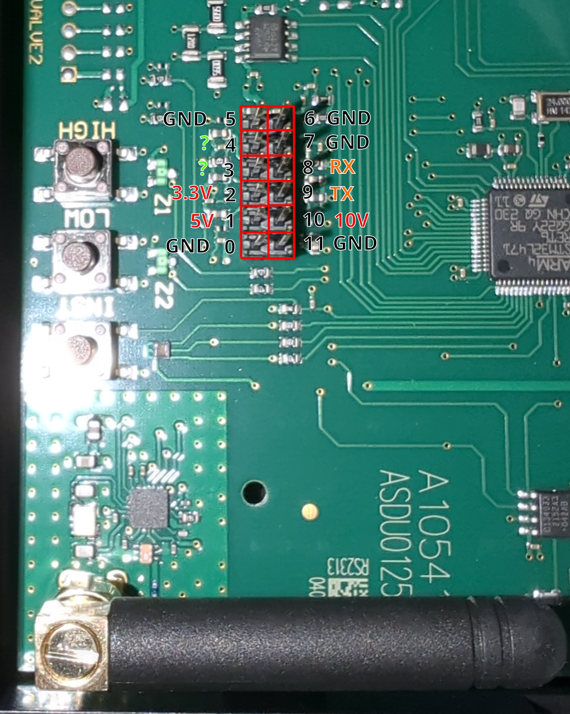

Duco Ventilation
================

.. seo::
    :description: Instructions for controlling a Duco ventilation system with ESPHome.
    :keywords: Duco, Ventilation, Connectivity Module

The Duco component allows you to operate a Duco ventilation system using ESPHome, without a need for the Duco Connectivity Board. This will directly communicate with the Duco ventilation system, through a UART connection.

Connecting to the ventilation system
------------------------------------

This component is able to communicate directly ventilation system. You only need to connect it to a UART bus on your ESPHome device.

A Duco ventilation system such as the DucoBox Energy Comfort D325 has a 12-pin connector that is easily reachable on the PCB. This has the following pinout:

Pins 8 (RX) and 9 (TX) can be directly connected to the :ref:`UART Component <uart>` component using jumper wires. As a bonus, you can also take either 3.3V or 5V power from the pins to power an ESP32.

The :ref:`UART Component <uart>` must be configured with a baud rate of 57600, 8 data bits, no parity, and 1 stop bit.

Note: this ESPHome module has only been tested on a DucoBox Energy Comfort D325. It does use the same communication protocol as the Duco Connectivity Board.

.. _duco-gettingstarted:

Getting started
---------------

To discover the available nodes available for the Duco module, the following can be configured:

.. code-block:: yaml

    duco:
      discovery: {}

This will output all nodes for the Duco module to the logs every minute, for example:

.. code-block:: text

    [00:00:00][I][duco:200]: Discovered nodes:
    [00:00:00][I][duco:203]:   Node 1: type 17 (BOX)
    [00:00:00][I][duco:203]:   Node 2: type 8 (UCBAT)
    [00:00:00][I][duco:203]:   Node 3: type 12 (UCCO2)
    [00:00:00][I][duco:203]:   Node 4: type 12 (UCCO2)
    [00:00:00][I][duco:203]:   Node 52: type 18 (SWITCH)
    [00:00:00][I][duco:203]:   Node 67: type 9 (UC)

This output shows six nodes connected to the Duco box. Some information can be read from them using this module. For example, you can read the ppm-value from the CO2-sensors with the following configuration:

.. code-block:: yaml

    sensor:
      - platform: duco
        co2:
          - address: 3
            name: "CO2 Bedroom"
          - address: 4
            name: "CO2 Livingroom"

Duco Component:
---------------

The Duco component can be configured as follows:

.. code-block:: yaml

    duco:
      id: ducobox
      uart_id: duco_uart
      discovery:
        update_interval: "10s"  # Will output the discovered nodes every 10 seconds

This will create a Duco component with discovery enabled, from a specific UART connection.

Configuration variables:
~~~~~~~~~~~~~~~~~~~~~~~~

- **id** (*Optional*, :ref:`config-id`): Manually specify the ID of the Duco component.
- **uart_id** (*Optional*, :ref:`config-id`): Manually specify the ID of the :ref:`UART Component <uart>` if you want to use multiple UART buses.
- **discovery** (*Optional*): Enables component discovery output.
    - **update_interval** (*Optional*, :ref:`config-time`): The interval to check the
      sensor. Set to ``never`` to disable updates. Defaults to ``60s``.

Select component:
-----------------

.. code-block:: yaml

    select:
      - platform: duco
        name: "Mode"

The select component allows you to view and change the current mode the Duco ventilation system is operating at. It supports the following modes:

+--------+---------------------------------------------+
| Value  | Description                                 |
+========+=============================================+
| AUTO   | Automatic flow rate selection               |
+--------+---------------------------------------------+
| MAN1   | Manual mode 1 for 15 minutes                |
+--------+---------------------------------------------+
| MAN2   | Manual mode 2 for 15 minutes                |
+--------+---------------------------------------------+
| MAN3   | Manual mode 3 for 15 minutes                |
+--------+---------------------------------------------+
| EMPT   | House empty, low flow rate                  |
+--------+---------------------------------------------+
| CNT1   | Indefinite manual mode 1                    |
+--------+---------------------------------------------+
| CNT2   | Indefinite manual mode 2                    |
+--------+---------------------------------------------+
| CNT3   | Indefinite manual mode 3                    |
+--------+---------------------------------------------+
| MAN1x2 | Manual mode 1 for 30 minutes                |
+--------+---------------------------------------------+
| MAN2x2 | Manual mode 2 for 30 minutes                |
+--------+---------------------------------------------+
| MAN3x2 | Manual mode 3 for 30 minutes                |
+--------+---------------------------------------------+
| MAN1x3 | Manual mode 1 for 45 minutes                |
+--------+---------------------------------------------+
| MAN2x3 | Manual mode 2 for 45 minutes                |
+--------+---------------------------------------------+
| MAN3x3 | Manual mode 3 for 45 minutes                |
+--------+---------------------------------------------+

Configuration variables:
~~~~~~~~~~~~~~~~~~~~~~~~

- **name** (*Required*, string): Name of the select component.
- **update_interval** (*Optional*, :ref:`config-time`): The interval to check the
  sensor. Set to ``never`` to disable updates. Defaults to ``60s``.
- All other options from :ref:`config-select`

Text Sensor component:
----------------------

Read the serial number for the Duco box:

.. code-block:: yaml

    text_sensor:
      - platform: duco
        name: "Serial Number"

Configuration variables:
~~~~~~~~~~~~~~~~~~~~~~~~

- **name** (*Required*, string): Name of the sensor.
- **update_interval** (*Optional*, :ref:`config-time`): The interval to check the
  sensor. Set to ``never`` to disable updates. Defaults to ``60s``.
- All other options from :ref:`config-sensor`

Sensor component:
-----------------

.. code-block:: yaml

    sensor:
      - platform: duco
        co2:
          - address: 3
            name: "CO2 Bedroom"
          - address: 4
            name: "CO2 Livingroom"
        filter_remaining:
          name: "Filter Time Remaining"
        flow_level:
          name: "Flow Level"
          update_interval: "5s"
        time_remaining:
          name: "Mode Time Remaining"
          update_interval: "5s"

Configuration variables:
~~~~~~~~~~~~~~~~~~~~~~~~

- **co2** (*Optional*): One or more CO2 sensors. With the following configuration options:
    - **address** (*Required*, int): Address of the CO2 sensor.
    - **name** (*Required*, string): Name of the sensor.
    - **update_interval** (*Optional*, :ref:`config-time`): The interval to check the
      sensor. Set to ``never`` to disable updates. Defaults to ``60s``.
    - All other options from :ref:`config-sensor`
- **filter_remaining** (*Optional*): Sensor for receiving filter status updates
    - **name** (*Required*, string): Sensor name
    - **update_interval** (*Optional*): The interval to check the
      sensor. Set to ``never`` to disable updates. Defaults to ``60s``.
    - All other options from :ref:`config-sensor`
- **flow_level** (*Optional*): Sensor for the flow level
    - **name** (*Required*, string): Sensor name
    - **update_interval** (*Optional*, :ref:`config-time`): The interval to check the
      sensor. Set to ``never`` to disable updates. Defaults to ``60s``.
    - All other options from :ref:`config-sensor`
- **time_remaining** (*Optional*): Sensor for the time remaining on the current mode
    - **name** (*Required*, string): Sensor name
    - **update_interval** (*Optional*, :ref:`config-time`): The interval to check the
      sensor. Set to ``never`` to disable updates. Defaults to ``60s``.
    - All other options from :ref:`config-sensor`

See Also
--------

- `Protocol Analysis <https://github.com/kokx/duco-reveng>`__
- :apiref:`duco/duco.h.h`
- :ghedit:`Edit`
